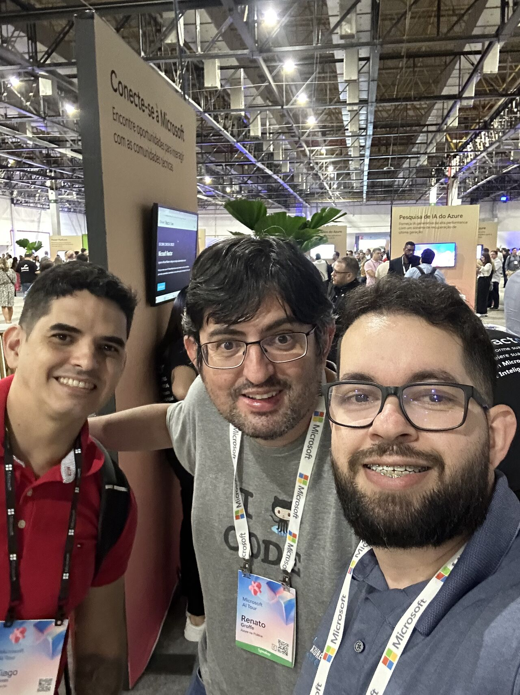
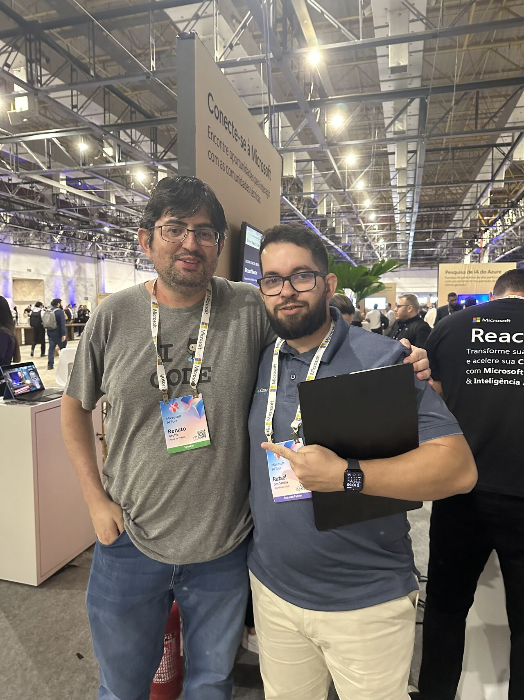
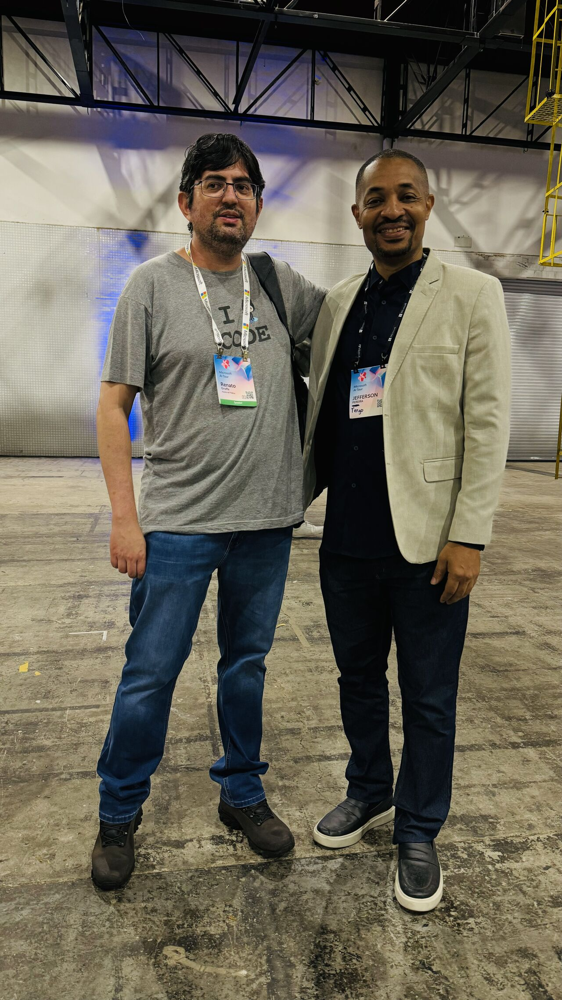

# HubExpert-MicrosoftAITour-2024-09
Fotos e informações gerais sobre minha participação no Hub Expert, durante o **Microsoft AI Tour** em São Paulo-SP no dia **26/09/2024 (quinta-feira)**.

Público que passou pelo espaço: **50 participantes (estimativa)**

Durante o evento respondi principalmente questionamentos sobre certificações, com destaque para exames como:
Foram abordadas as seguintes certificações durante o evento:
- **AZ-900: Azure Fundamentals**
- **AZ-204: Azure Developer Associate**
- **AZ-104: Azure Administrator Associate**
- **AZ-400: Designing and Implementing Microsoft DevOps Solutions**
- **AI-900: Azure AI Fundamentals**
- **AI-102: Azure AI Engineer Associate**
- **DP-900: Azure Data Fundamentals**
- **AZ-305: Designing Microsoft Azure Infrastructure Solutions**

Local: **Transamerica Expo Center - Av. Dr. Mário Vilas Boas Rodrigues, 387 - Santo Amaro - São Paulo - SP - CEP: 04757-020**

Deixo aqui meu agradecimentos à **Microsoft**, em especial ao **Victor Temple** e à **Larissa Cyganski** pela oportunidade e todo o apoio para que eu participasse do Hub Expert nesta edição do **Microsoft AI Tour** em **São Paulo-SP**.

Invite da Microsoft solicitando minha participação no **Hub Expert**:

Fotos no evento:

